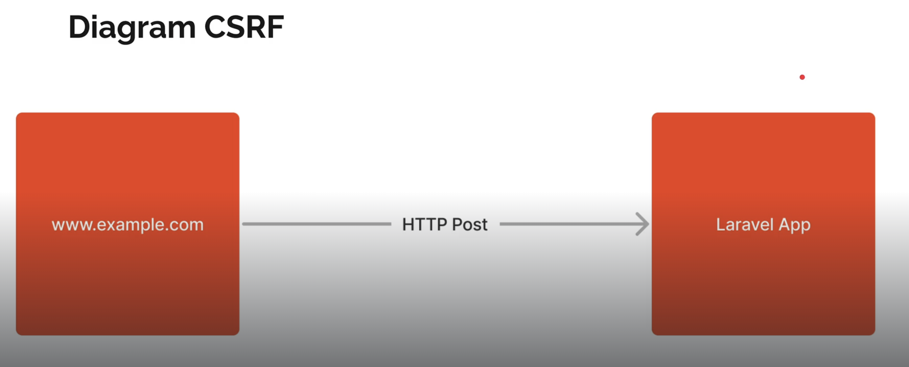

# Cross Site Request Forgery (CSRF)
CSRF merupakan salah satu security exploit yang biasanya dilakukan untuk mengirim action ke aplikasi web dark web orang lain cross domain.

Diagaram sederhana:


Untuk mencegah hal tersebut maka diperlukan semacam token yang hanya diketahui oleh aplikasi kita sendiri.

Untuk contoh , bisa kita buat view untuk form:
```php
<html>
    <head>
        <title>Ini Form</title>
    </head>
    <body>
        <form action="/form" method="post">
            <label for="Nama">
                <input type="text" name="name">
            </label>
            <input type="submit" value="Say Hello">
        </form>
    </body>
</html>
```

Kemudian untuk controller nya:
```php
public function form(): Response
{
    return response()->view("form");
}
public function submitForm(Request $request): Response
{
    $name = $request->input("name");
    return response()->view('hello', [
        'name' => $name
    ]);
}
```
Kemudian untuk routenya:
```php
Route::get('/form',[FormController::class,'form']);
Route::post('/form', [FormController::class,'submitForm']);
```

Ketika ditest pertama kali, maka hasilnya expired. Hal ini disebabkan karena saat submit form, tidak mengirim csrf token.

Tambahkan csrf token pada form:
```php
<html>
    <head>
        <title>Ini Form</title>
    </head>
    <body>
        <form action="/form" method="post">
            <label for="Nama">
                <input type="text" name="name">
            </label>
            <input type="submit" value="Say Hello">
            <input type="hidden" name="_token" value="{{csrf_token()}}">
        </form>
    </body>
</html>
```