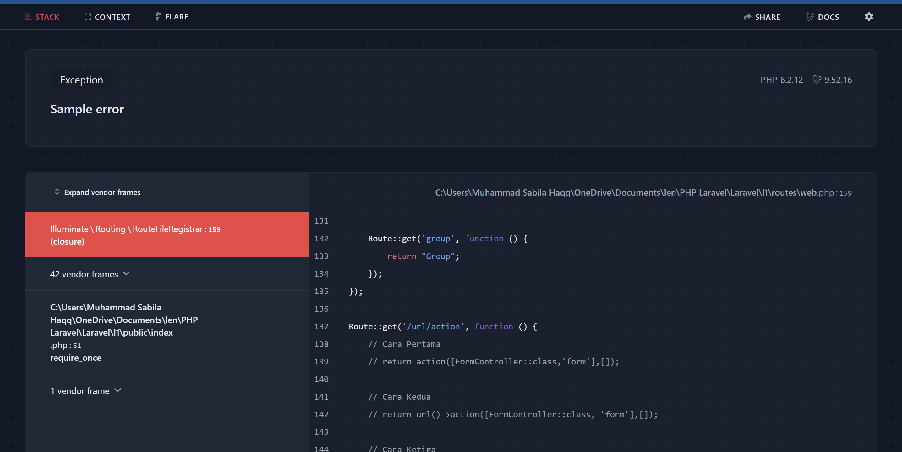

# Error Handling

Exception pada laravel dapat dimodif pada file handler di */app/Exceptions/Handler.php*. Jadi secara default, laravel sudah menghandle untuk bagian error. Pada level development atau local, biasanya debug di set menjadi true, sedangkan production di set menjadi false.

Sebagai contoh, coba implement throw error:
```php
Route::get('/error/sample', function(){
    throw new Exception('Sample error');
});
```
Ketika mengakses /error/sample, maka akan muncul debug:


## Error Reporter
Terkadang ketika terjadi error, kita ingin mereport error tersebut. Hal ini bisa dilakukan pada **Handler.php**, pada code:
```php
 public function register()
    {
        $this->reportable(function (Throwable $e) {
            //
            var_dump($e);
        });
    }
```
Pada code diatas, error tersebut bisa lempar ke email/slack atau lain-lain.

## Manual Report
Ada beberapa kasus dimana ingin custom report ketika terjadi error. Contoh misal:
```php
Route::get('/error/manual', function(){
    report(new Exception('Sample manual'));
    return "OK";
});
```
## Ignore Execption
Ada kondisi dimana jika terjadi error kita bisa meng-ignore exception sehingga tidak perlu melakukan report. 
Untuk bisa melakukan hal tersebut maka perlu membuat custom error. Sebagai contoh jika error yang terjadi adalah error validation.

Buat ValidationException.php di *app\Exceptions*
```php
<?php

namespace App\Exceptions;

class ValidationException extends \Exception
{
    public function __construct(string $message)
    {
        parent::__construct($message);
    }
}
```

Kemudian registrasikan pada di Handler.php
```php
/**
     * A list of the exception types that are not reported.
     *
     * @var array<int, class-string<\Throwable>>
     */
    protected $dontReport = [
        ValidationException::class
    ];

```

Pada route:
```php
Route::get('/error/validation', function(){
    throw new ValidationException('Validation Error');
});
```
Dengan demikian, error validation tidak akan dimunculkan pada table karena sudah diregistrasikan pada Handler.php

## Rendering Exception
Pada laravel juga bisa menampilkan custom halaman ketika terjadi exception.
Hal ini bisa dilakukan pada Handler.php
```php
$this->renderable(function(ValidationException $exception,Request $request){
    return response("Bad Request", 400);
});
```
Dengan demikian jika terjadi error maka akan menampilkan custome halaman.