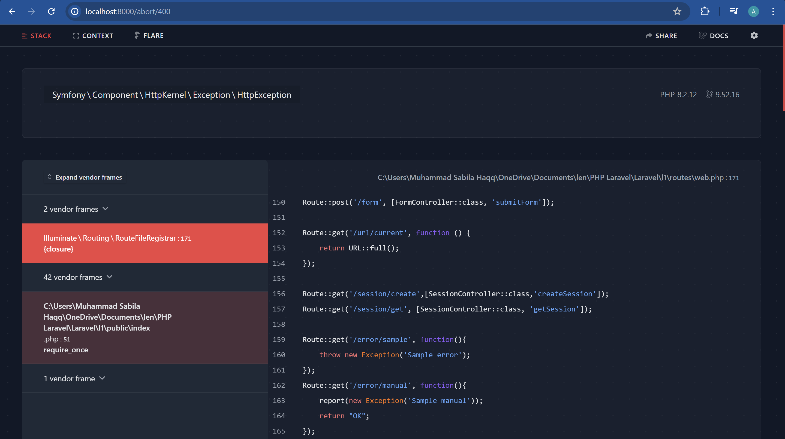
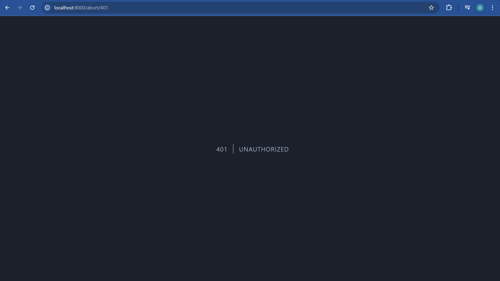
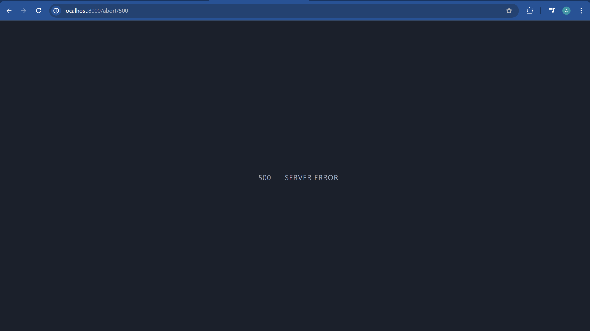
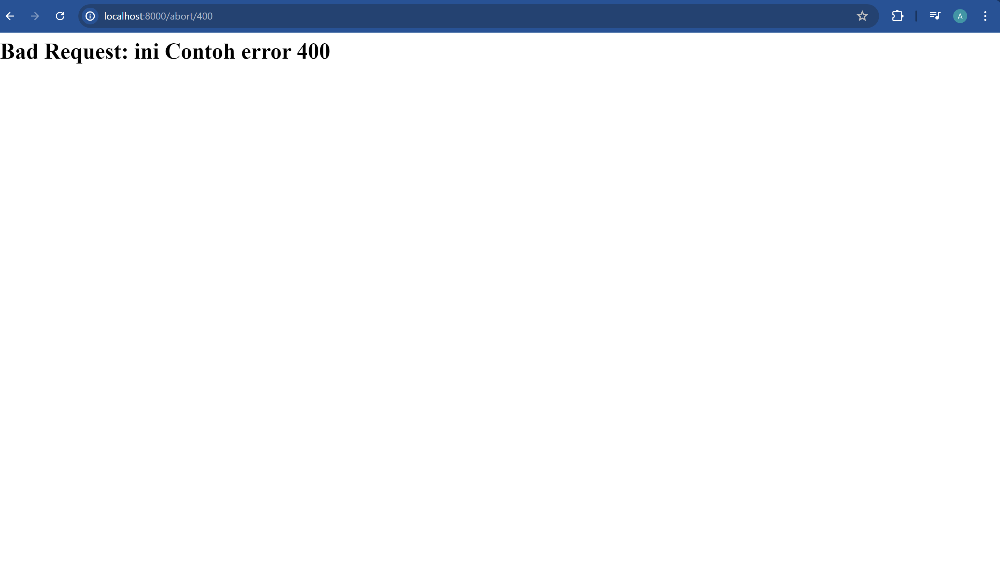

# HTTP Exception
Laravel menyediakan sebuah class Exception untuk error. Class tersebut dari
*Symfony\Component\HttpKernel\Exception\HttpException*. Contoh implementasi
```php
Route::get('/abort/400', function(){
    abort(400);
});
Route::get('/abort/401', function(){
    abort(401);
});
Route::get('/abort/500', function(){
    abort(500);
});
```
Untuk result nya seperti ini






## Http Error Page
By default, ketika terjadi error laravel akan meload halaman error yang sudah dibuat dari laravel. Apabila kita ingin membuat customer error halaman, bisa menggunakan blade template.
Contoh , misal buat file *resources/views/errors/400.blade.php*
```php
<html>
    <head>
        <title>Bad Request</title>
    </head>
    <body>
        <h1>Bad Request: {{$exception->getMessage()}}</h1>
    </body>
</html>
```

Ketika akses kembalik 400:
```php

```

Error page yang di load akan disesuaikan, misal ketika errornya adalah 401 maka akan meload 401.blade.php dst.