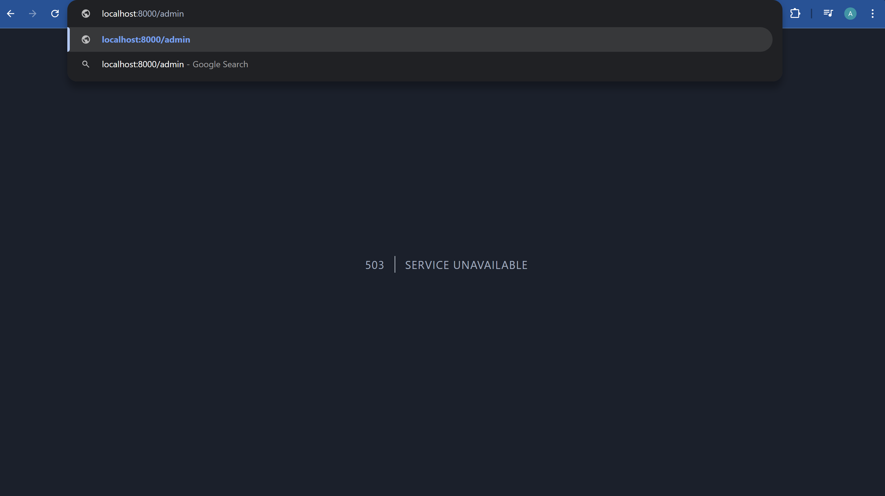

# Maintanance Mode

Laravel mendukung maintanance mode dimana aplikasi dapat dijadikan mode maintanance, sehingga semua request akan mendapatkan Http Exception 503.

Untuk menjalankan maintanance-mode bisa menggunakan perintah
```
php artisan down
```
Maka akan terbuat file di storage/framework/down. Jika ingin meng-up kembali maka bisa menjalankan
```
php artisan up
```

## Secret 
Terkadang ada kondisi dimana kita ingin mengakses aplikasi walaupun dalam keadaan maintenance. Untuk bisa melakukan hal tersebut perlu secret key. Untuk menjalankannya
```
php artisan down --secret="admin"
```

Ketika dijalankan maka terlihat seperti ini:


Pada gambar terlihat bahwa untuk memasukkan secret hanya menambahkan setelah slash.