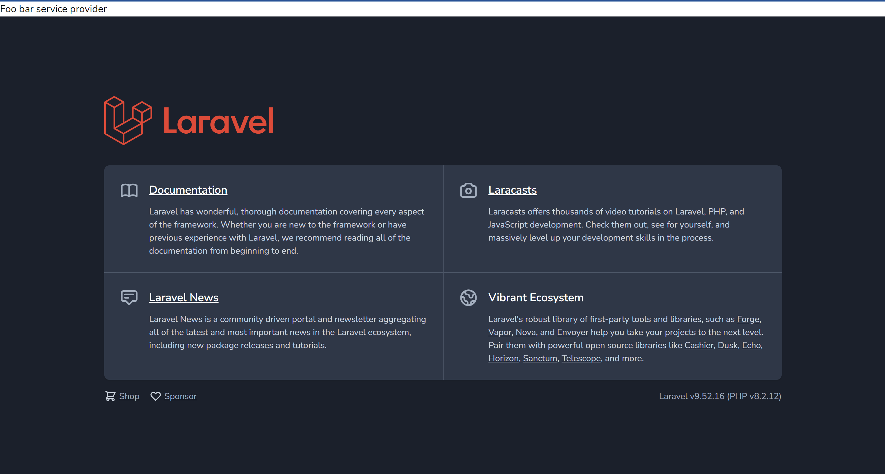

# Service Provider

Service provider merupakan penyedia service yang akan digunakan pada laravel. Untuk membuat service provider:

```
php artisan make:provider FooBarServiceProvider
```

FooBarServiceProvider

```php
<?php

namespace App\Providers;

use Illuminate\Support\ServiceProvider;

class FooBarServiceProvider extends ServiceProvider
{
    /**
     * Register services.
     *
     * @return void
     */
    public function register()
    {
        //
    }

    /**
     * Bootstrap services.
     *
     * @return void
     */
    public function boot()
    {
        //
    }
}
```

Pada service provider terdapat 2 method yaitu, register dan boot. register() dilakukan untuk meregistrasikan semua dependency yang dibutuhkan service. Sedangkan boot() dipanggil setelah register() dimana pada boot kita bisa membangun logic service.

Pada register, registrasikan Foo dan Bar:

```php
public function register()
    {
        $this->app->singleton(Foo::class, function($app){
            return new Foo();
        });

        $this->app->singleton(Bar::class, function($app){
            $foo = $app->make(Foo::class);
            return new Bar($foo);
        });

    }
```

Kemudian registrasikan service provider pada **/config/app.php** , cari bagian service provider

Untuk testing bisa buat unit test FooBarServiceProvider.
FooBarServiceProviderTest.php

```php
 public function testServiceProvider()
    {
        $foo1 = $this->app->make(Foo::class);
        $foo2 = $this->app->make(Foo::class);

        self::assertSame($foo1, $foo2);

        $bar1 = $this->app->make(Bar::class);
        $bar2 = $this->app->make(Bar::class);

        self::assertSame($bar1, $bar2);

        self::assertSame($foo1, $bar1->foo);
        self::assertSame($foo2, $bar2->foo);
    }
```

Pada code diatas, kita tidak perlu mendefine ulang bahwa Foo dan Bar singleton, dikarenakan hal tersebut sudah dilakukan pada Service Provider FooBar yang sudah diregistrasikan.

## Binding & Singleton

Untuk binding sederhan bisa menggunakan binding via properties di Service Provider. Bisa juga menambahkan property bindings untuk membuat binding atau menggunakan property singletons untuk membuat binding singleton.

```php
class FooBarServiceProvider extends ServiceProvider
{
    public array $singletons = [
        HelloService::class => HelloServiceIndonesia::class
    ];

    public register()
    {

    }
    ...
    ...
}
```

Pada unit test

```php
public function testPropertySingletons()
    {
        $helloService1 = $this->app->make(HelloService::class);
        $helloService2 = $this->app->make(HelloService::class);

        self::assertSame($helloService1, $helloService2);
    }
```

## Deferred Provider

By default semua service provider akan di load oleh laravel baik dibutuhkan atau tidak. Untuk mencegah hal tersebut, bisa ditandai service provider mana yang tidak load jika tidak dibutuhkan menggunakan Deferred Provider. Hal ini dilakukan dengan cara menandai service provider dan implement interface **DeferrableProvider** , lalu implement method **provides()** yang memberi tahu tipe dependency apa saja yang terdapa pada service provider. Setiap ada request baru, maka Service Provider yang sudah deferred tidak akan diload jika memang tidak dibutuhkan.

Contoh, pada FooBarServiceProvider:

```php
class FooBarServiceProvider extends ServiceProvider implements DeferrableProvider
{
    ....
}
```

Kemudian pada method provides

```php
public function provides()
    {
        return [
            HelloService::class,
            Foo::class,
            Bar::class
        ];
    }
```
Dengan demikian dependency HelloService, Foo dan Bar tidak akan langsung diload, namun diload ketika dibutuhkan (lazy).

Untuk testing, perlu dipastikan bahwa FooBarServiceProvider sudah berada di deferred. Hal ini bisa dicek pada */bootstrap/cache/service.php*. Jika masih dalam 'eager' maka perlu diclear. Selanjutnya untuk testing bisa menjalankan:
```
php artisan serve
```
Buka localhost:8000 , ketika aplikasi dibuka, service provide tidak akan ke load


Jika kita pindahkan ke eager:

